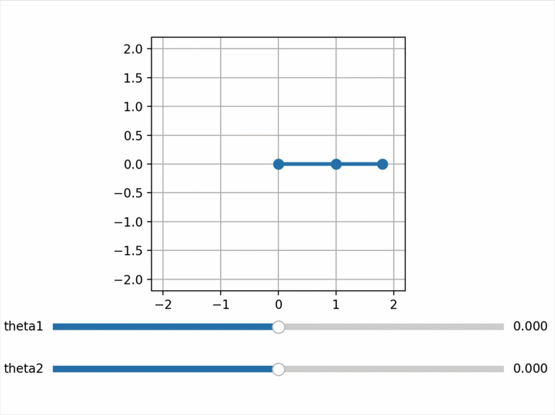
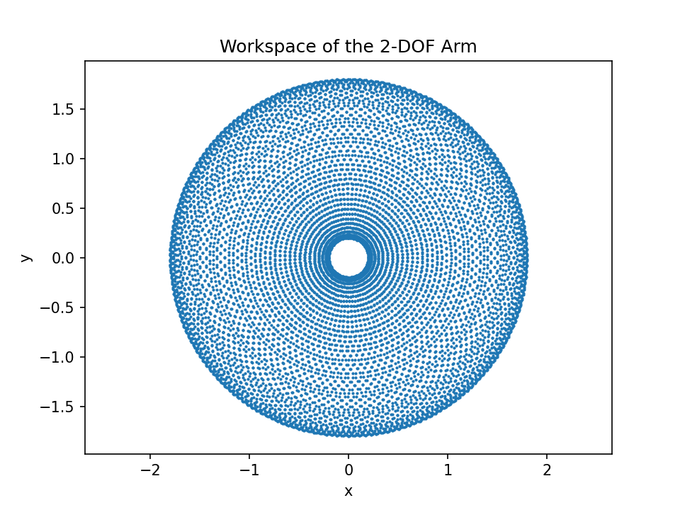

# Planar Robot Arm — Forward Kinematics



An interactive 2-link planar arm: drag the sliders to command joint angles and
watch the arm follow. Forward kinematics is computed as a chain of
rigid transforms — each joint is "rotate by θᵢ, then translate along the link" —

## Workspace



Sampling all joint-angle combinations reveals the reachable workspace: an
annulus with outer radius L₁+L₂ and inner radius |L₁−L₂|. 

## Concepts covered

- Forward kinematics (FK) of serial manipulators
- Joint space vs Cartesian space
- Joints as composed rigid transforms (rotate-then-translate ordering)
- Reachable workspace and its geometry
- Interactive Matplotlib widgets (sliders + callbacks)

## Code structure

- `arm.py` — `Arm` class: geometry stored at construction,
  joint angles passed per call, poses always derived — never cached.
  `fk(angles)` returns the full pose chain; `end_effector(angles)` the tip.
- `transforms2d.py` — the `Pose2D` library from Project A1 (vendored).
- `demo.py` — interactive slider demo.
- `workspace.py` — workspace sampling and plot.
- `test_arm.py` — pytest suite (construction guards, straight/bent-arm FK
  against hand-computed poses, angle-aware comparisons, wiring tests).

## Run it

```bash
pip3 install numpy matplotlib pytest
python3 demo.py         # interactive arm
python3 workspace.py    # workspace plot
pytest                  # tests
```

